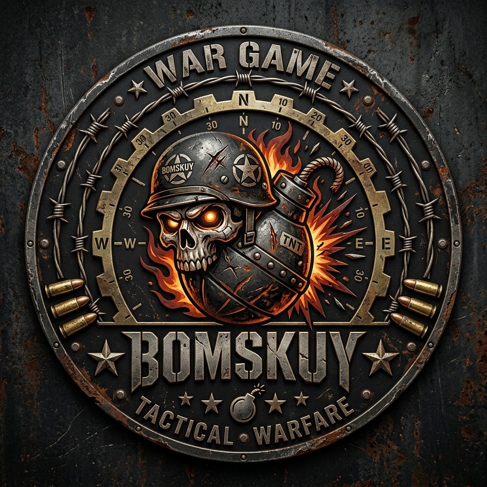

#  BOMSKUY — Tactical Combat Edukasi

<p align="center">
  
</p>

<h3 align="center">BOMSKUY 💣</h3>

<p align="center">
  <strong>Destroy · Answer · Conquer</strong><br />
  A premium, high-fidelity tactical combat educational game styled in AAA Military Operations.
</p>

<p align="center">
  <a href="https://developer.mozilla.org/en-US/docs/Web/JavaScript"></a>
  <a href="https://webrtc.org/"></a>
  <a href="https://firebase.google.com/"></a>
  <a href="https://html.spec.whatwg.org/"></a>
</p>

---

## 📖 Overview

**BOMSKUY** is a modern, high-performance web-based action-puzzle game that combines the classic tactical grid combat of "Bomberman" with an immersive educational trivia system. Wrapped in a premium military theater aesthetic, players deploy into active combat zones, blast their way through obstacles, eliminate hostiles, and crack military intelligence (intel) by answering curriculum-based questions to receive high-value tactical upgrades.

Developed with pure **HTML5 Canvas, CSS Custom Variables, and Vanilla ES6+ JavaScript**, BOMSKUY features an online multiplayer system powered by **WebRTC Peer-to-Peer** networking and **Firebase Realtime Database** for decentralized, low-latency matchmaking and global high-score rankings.

---

## 🎮 Game Modes

### 🕹️ Singleplayer (Offline Operations)
* Deploy solo into simulated battlefields.
* Eliminate all computer-controlled hostiles across multiple operations (customizable to **3, 5, or 7 Operations**).
* Adaptive AI difficulty ranges from **Recruit (Easy)** to **Veteran (Normal)** and **Elite (Hard)**.

### ⚔️ Multiplayer (Online WebRTC P2P)
* Host or Join custom tactical rooms using a unique lobby code (e.g., `BOM-5812`).
* Zero-latency Peer-to-Peer movement synchronization and bomb placement powered by **WebRTC DataChannels**.
* Real-time match configurations, state management, and high-performance peer heartbeat monitoring.

---

## 🏛️ Theaters of Operations (Themed Subjects)

The game dynamically adjusts its visual palette, music speed, character sprites, and question banks based on the selected **Theater of Operations**:

| Subject / Map Theme | 🎭 Player Archetype | 👿 Enemy Archetype | 🎨 Visual Palette | 📚 Question Focus |
| :--- | :--- | :--- | :--- | :--- |
| **🎓 All Theaters** *(Default)* | Special Forces Operative | Hostile Mercenaries | Sleek Cyberpunk Cyan & Red | Mixed Curriculum Questions |
| **🏛️ Sejarah** *(History)* | Indonesian Freedom Fighters | Colonial Occupiers | Warm Bamboo & Terracotta Gold | Indonesian History & Milestones |
| **⚖️ PKN** *(Civics & Law)* | Tactical Prosecutors | Corrupt White-Collar Criminals | deep Cobalt Blue & Neon Cyan | Constitutional Law & Citizenship |
| **☪️ Agama Islam** *(Islamic Studies)* | Holy Santri Students | Malevolent Spirits (Setan) | Emerald Jade & Spiritual Green | Islamic Pillars, History & Theology |

---

## ⚡ Tactical Power-Ups & Intel System

Destroying breakable crates (cover) has a chance to drop vital tactical items. Acquire them to tilt the odds in your favor:

| Item | Icon | Tactical Effect |
| :--- | :---: | :--- |
| **Quiz / Intel** | 📚 | Triggers an interactive educational question. Answering correctly grants **+200 Points** and random high-tier combat buffs! |
| **Speed Boost** | ⚡ | Temporarily increases movement speed. Lasts for **10 seconds**. |
| **Blast Expansion** | 🔥 | Permanently increases the explosion radius of your bombs by **+1 tile**. |
| **Bomb Capacity** | 💣 | Permanently increases the maximum number of bombs you can place simultaneously. |
| **Shield Generator** | 🛡️ | Grants temporary invincibility, absorbing all damage. Lasts for **8 seconds**. |
| **Cryo Freeze** | ❄️ | Freezes all active hostiles in place, leaving them vulnerable. Lasts for **5 seconds**. |
| **Score Magnet** | 🧲 | Automatically attracts score items and active points. Doubles score gains (**2x Multiplier**) for **12 seconds**. |
| **Medkit / Heart** | 💖 | Restores **+1 Life (HP)** up to the maximum capacity of 3 hearts. |

---

## ⌨️ Control Schemes

BOMSKUY supports full cross-platform responsive gameplay:

### 💻 PC Controls
* **Movement:** `W` `A` `S` `D` or `Arrow Keys`
* **Deploy Bomb:** `Spacebar`
* **Tactical Pause:** `ESC` or `P`

### 📱 Mobile Controls
* **Movement:** High-precision responsive **Virtual Joystick** rendered directly on a canvas overlay (supports dynamic touch-tracking).
* **Deploy Bomb:** Dedicated, oversized tactical tactile **BOM Button** positioned on the bottom right.

---

## 🛠️ Technical Highlights

1. **Decentralized Multiplayer Architecture:** 
   * Firebase RTDB is utilized *exclusively* for room discovery, handshake exchange (SDP/ICE candidates), and live Signaling.
   * Once connected, the host and guest transition fully to **WebRTC Peer-to-Peer DataChannels**, bypassing server latency entirely for 60Hz coordinate updates.
   * Auto-fallback to public **Google STUN** servers and dynamic third-party **TURN credential provisioning** (via Metered API) ensures successful P2P penetration even through strict corporate symmetric NATs.

2. **Ultra-Smooth 60 FPS Engine:**
   * Built on a custom game loop using `requestAnimationFrame`.
   * Features high-DPI canvas subpixel scaling (`devicePixelRatio` optimization) to ensure razor-sharp rendering on modern 4K/Retina displays, with dynamic auto-capping on mobile devices to prevent thermal throttling.
   * Entity-component physics boundaries with axis-aligned bounding box (AABB) tile-based sliding collision, allowing smooth cornering.

3. **Dynamic Responsive CSS Framework:**
   * Utilizes HSL-tailored color schemes, glassmorphic overlay backdrops, complex CSS glowing drop-shadows, and micro-interactions.
   * Complete modular screen management (`.screen.active` routing) without page refreshes.

4. **Global Military Rankings:**
   * Persistence of player callsigns and match history.
   * Local storage fallback paired with global Firebase real-time database writeback to track and display the **Top 5 Operatives** and complete historical rankings.

---

## 🚀 Installation & Local Deployment

Since BOMSKUY is a standard HTML5/JS project, it requires **no installation** or heavy dependencies. You can run it locally in seconds:

### Quick Start
1. Clone the repository to your local machine:
   ```bash
   git clone https://github.com/yourusername/bomskuy.git
   ```
2. Navigate to the project directory:
   ```bash
   cd bomskuy
   ```
3. Open `game.html` in any modern web browser (Chrome, Firefox, Edge, Safari).
   * *Alternatively, for the best experience (especially for WebRTC multiplayer), serve the files using a local development server (e.g., Live Server extension in VS Code or Python's HTTP server):*
     ```bash
     python -m http.server 8000
     ```
     Then navigate to `http://localhost:8000/game.html`.

---

## 📂 File Directory Structure
```filepath
bomskuy-release/
├── game.html                  # Main entry point and premium military HUD UI structure
├── game.css                   # Custom responsive AAA styling, animations, and design tokens
├── game.js                    # Core 2D engine, WebRTC P2P handler, and database state integration
├── logo_bomskuy.png           # High-resolution game logo
├── bg_main.png                # Immersive welcome screen military war background
├── menu_bg_war.png            # Alternate battlefield background asset
├── gameover_bg.png            # Defeat screen splash art
├── bg_agama.png               # Islamic studies map thematic background
├── bg_pkn.png                 # Civics map thematic background
├── bg_sejarah.png             # History map thematic background
├── sprite_player_*.png        # Directional player sprite sheets per subject theme
├── sprite_enemy_*.png         # Enemy sprite sheets per subject theme
├── tutor_controlpc.png        # Keyboard controls visual aid
├── tutor_controlhp.png        # Mobile touch controls visual aid
└── tutor_multiply.png         # General multiplayer gameplay briefing image
```

---

## ⚡ Signaling & Database Credentials

BOMSKUY comes pre-configured with a default Firebase staging database for signaling. If you wish to host your own dedicated server instance, locate the `FIREBASE_CONFIG` object inside `game.js` and update it with your proprietary credentials:

```javascript
const FIREBASE_CONFIG = {
  apiKey: "YOUR_API_KEY",
  authDomain: "YOUR_PROJECT.firebaseapp.com",
  databaseURL: "https://YOUR_PROJECT-default-rtdb.firebaseio.com",
  projectId: "YOUR_PROJECT",
  storageBucket: "YOUR_PROJECT.appspot.com",
  messagingSenderId: "YOUR_SENDER_ID",
  appId: "YOUR_APP_ID"
};
```

```javascript
async function getIceServersConfig() {
  if (fetchedIceServers) {
    return { iceServers: fetchedIceServers };
  }
  try {
    console.log("Fetching TURN servers from Metered...");
    const response = await fetch("your turn servers here");
    if (!response.ok) {
      throw new Error(`Failed to fetch TURN credentials: ${response.statusText}`);
    }
    const servers = await response.json();
    fetchedIceServers = servers;
    console.log("TURN servers fetched successfully:", servers);
    return { iceServers: servers };
  } catch (err) {
    console.error("Failed to fetch TURN servers, using fallback Google STUN:", err);
    return ICE_SERVERS;
  }
}
```
---

## 📜 Credits & License

* **Lead Developers:** BRIGHTZ-SEC
* **Concept Inspiration:** Classic Hudson Soft's Bomberman series combined with active Indonesian academic curricula.
* **License:** Distributed under the MIT License. See `LICENSE` for more details.

---

<p align="center">
  🛡️ <em>"Deploy to the combat zone, secure the intelligence, and claim your place in the military rankings!"</em> 🛡️
</p>
